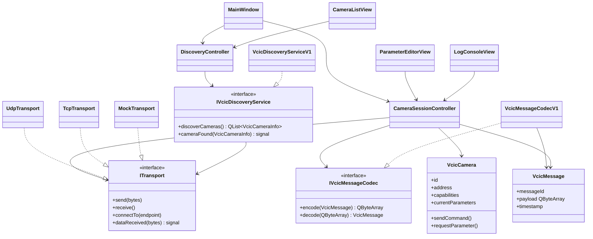
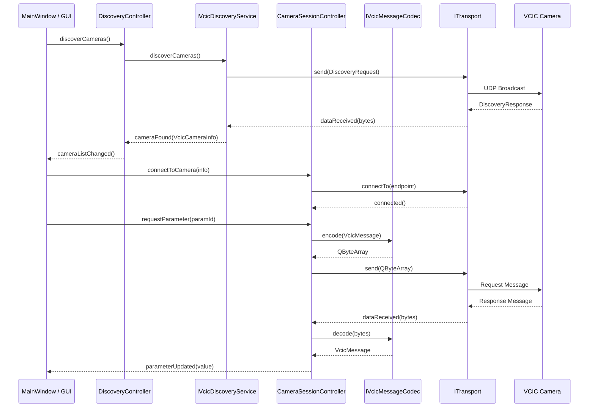

# VCIC Qt App – Architecture Design

Architecture proposal for a C++/Qt-based open-source application implementing the
ISO 17215 "Video Communication Interface for Cameras" (VCIC) standard.

> **Note on the standard:** ISO 17215 is copyright-protected and not freely available.
> This architecture contains **no** content from the standard text (no message IDs, no
> byte layouts, no tables). These details must be filled in from a legally obtained copy
> of the standard into the implementations marked as `V1` classes.

## Overview of standard parts

| Part | Content | Maps to in architecture |
|------|---------|------------------------|
| ISO 17215-1 | Overview, use cases, shared definitions | – (conceptual foundation) |
| ISO 17215-2 | Discovery & control of camera services | `IVcicDiscoveryService` |
| ISO 17215-3 | Camera Message Dictionary (OSI Layer 7) | `IVcicMessageCodec` / `VcicMessage` |
| ISO 17215-4 | Communication requirements OSI Layer 1–4 | `ITransport` |

## Architectural principle

The application is split into four layers (Layered Architecture + Adapter Pattern)
so that transport and protocol encoding are independently interchangeable and testable
(e.g. with a `MockTransport` without real camera hardware).

```
┌─────────────────────────────────────────────────────────┐
│                  GUI Layer (Qt Widgets/QML)              │
│  MainWindow, CameraListView, ParameterEditorView,        │
│  LogConsoleView                                          │
└───────────────────────┬─────────────────────────────────┘
                         │ Signals/Slots
┌────────────────────────▼─────────────────────────────────┐
│              Application/Controller Layer                 │
│  CameraSessionController, DiscoveryController             │
└────────────────────────┬─────────────────────────────────┘
                         │
┌────────────────────────▼─────────────────────────────────┐
│              VCIC Protocol Layer (Parts 2 + 3)            │
│  IVcicDiscoveryService, IVcicMessageCodec,                │
│  VcicCamera (model class), VcicMessage (data type)        │
└────────────────────────┬─────────────────────────────────┘
                         │
┌────────────────────────▼─────────────────────────────────┐
│              Transport Layer (Part 4)                     │
│  ITransport (interface), UdpTransport, TcpTransport,      │
│  MockTransport                                            │
└──────────────────────────────────────────────────────────┘
```

## Class responsibilities

### Transport Layer (corresponds to Part 4)

| Class | Responsibility |
|-------|---------------|
| `ITransport` | Abstract interface: `send(bytes)`, `receive()`, `connectTo(endpoint)`, signal `dataReceived(bytes)` |
| `UdpTransport : ITransport` | Concrete implementation based on Qt `QUdpSocket` |
| `TcpTransport : ITransport` | Concrete implementation based on Qt `QTcpSocket`, as required by Part 4 |
| `MockTransport : ITransport` | Implementation for automated tests without real hardware |

### VCIC Protocol Layer (corresponds to Parts 2 + 3)

| Class | Responsibility |
|-------|---------------|
| `VcicMessage` | Pure data container: `messageId`, `payload (QByteArray)`, `timestamp` |
| `IVcicMessageCodec` | Interface: `encode(VcicMessage) → QByteArray`, `decode(QByteArray) → VcicMessage` |
| `VcicMessageCodecV1 : IVcicMessageCodec` | Concrete implementation per Part 3 — **message IDs/structures from the standard are entered here** |
| `IVcicDiscoveryService` | Interface: `discoverCameras() → QList<VcicCameraInfo>`, signal `cameraFound(VcicCameraInfo)` |
| `VcicDiscoveryServiceV1 : IVcicDiscoveryService` | Concrete discovery implementation per Part 2 |
| `VcicCamera` | Model class: `id`, `address`, `capabilities`, `currentParameters`, methods `sendCommand()`, `requestParameter()` |

### Application/Controller Layer

| Class | Responsibility |
|-------|---------------|
| `DiscoveryController` | Orchestrates `IVcicDiscoveryService`, holds list of discovered cameras, exposes them as Qt property/model to the GUI |
| `CameraSessionController` | Manages active connection to a `VcicCamera`, translates GUI actions into `VcicMessage` objects, uses `IVcicMessageCodec` + `ITransport` |

### GUI Layer

| Class | Responsibility |
|-------|---------------|
| `MainWindow` | Main window, tabs/docks |
| `CameraListView` | Displays discovered cameras (Qt `QListView` + model) |
| `ParameterEditorView` | Displays/edits camera parameters (Qt `QTableView` + model) |
| `LogConsoleView` | Displays raw sent/received messages for diagnostics |

## UML class diagram (Mermaid)



## Sequence diagram: Discovery → Connection → Parameter request



## Recommendations for project start

1. **Build system:** CMake + Qt6, with clear module separation as separate CMake targets:
   - `libvcic-transport`
   - `libvcic-protocol`
   - `app-gui`

   This also allows a pure CLI variant without GUI later on.

2. **Clarify licensing early:** For a real open-source release, no content from the ISO standard
   may be quoted directly in source code or comments (e.g. no copied tables with message
   descriptions) — only the self-implemented resulting constants/structures.

3. **Development order:**
   - Start with `MockTransport` and dummy messages
   - Complete GUI and controller logic
   - Only at the end fill `VcicMessageCodecV1` / `VcicDiscoveryServiceV1` with the real
     values from the purchased standard

## Sources for the standard

| Part | Title | Cost (at time of research) |
|------|-------|---------------------------|
| ISO 17215-3:2021 | Camera message dictionary | CHF 181 |
| ISO 17215-4:2014 | Implementation of communication requirements | CHF 67 |

Available directly from [iso.org](https://www.iso.org) or national standards bodies
(e.g. DIN in Germany), often also via university or corporate access.
